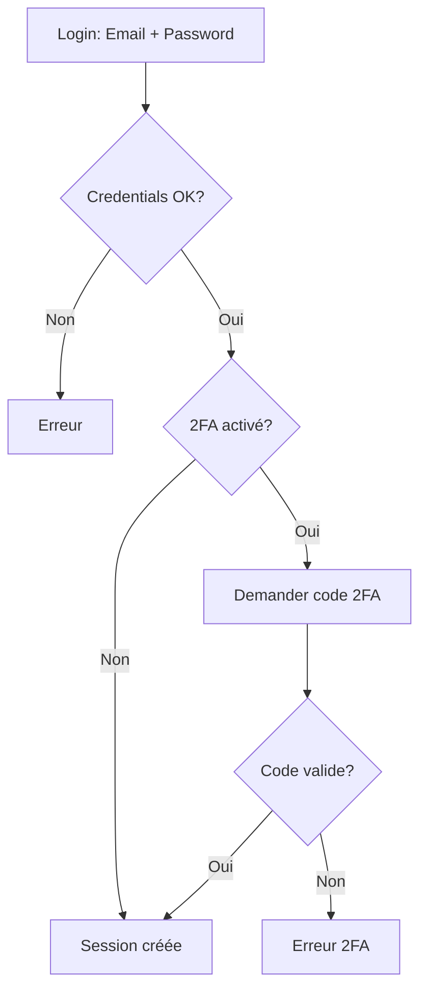

# 🔐 Authentification à Deux Facteurs (2FA)

## Vue d'ensemble

Le système 2FA est maintenant intégré au portfolio admin pour renforcer la sécurité. Il utilise Google Authenticator (ou toute application compatible TOTP) pour générer des codes à usage unique.

---

## ✨ Fonctionnalités

### 1. **Configuration facile**
- QR code pour configuration rapide
- Interface utilisateur intuitive
- Codes de secours générés automatiquement

### 2. **Sécurité renforcée**
- Codes TOTP de 6 chiffres
- Fenêtre de validation de ±60 secondes
- 10 codes de secours à usage unique
- Secrets stockés de manière sécurisée

### 3. **Gestion complète**
- Activation/désactivation à volonté
- Régénération des codes de secours
- Visualisation du statut
- Logs d'audit pour toutes les actions

---

## 🚀 Guide d'utilisation

### Activation du 2FA

1. **Connectez-vous** à l'interface admin
2. **Accédez** à `/admin/2fa` ou cliquez sur "Sécurité 2FA" dans le dashboard
3. **Cliquez** sur "Activer le 2FA"
4. **Scannez** le QR code avec Google Authenticator
5. **Sauvegardez** vos codes de secours (téléchargez-les)
6. **Entrez** le code à 6 chiffres pour vérifier
7. **Validez** - Le 2FA est maintenant actif ! 🎉

### Connexion avec 2FA

1. **Entrez** votre email et mot de passe normalement
2. **Un champ supplémentaire** apparaît pour le code 2FA
3. **Entrez** le code de votre application (6 chiffres)
   - OU utilisez un code de secours si nécessaire
4. **Connectez-vous** - Vous êtes authentifié ! ✅

### Codes de secours

Les codes de secours vous permettent de vous connecter si :
- Vous perdez votre téléphone
- Vous n'avez pas accès à Google Authenticator
- Vous changez d'appareil

⚠️ **IMPORTANT** :
- Chaque code ne peut être utilisé qu'**une seule fois**
- Gardez-les dans un **endroit sûr** (coffre-fort, gestionnaire de mots de passe)
- Régénérez-les si vous les avez tous utilisés

### Régénération des codes

1. Allez sur `/admin/2fa`
2. Cliquez sur "Régénérer codes de secours"
3. Téléchargez les nouveaux codes
4. Les anciens codes ne fonctionneront plus ⚠️

### Désactivation du 2FA

1. Allez sur `/admin/2fa`
2. Cliquez sur "Désactiver 2FA"
3. Confirmez votre choix
4. Le 2FA est désactivé (non recommandé pour la production)

---

## 🔧 Détails techniques

### Architecture

```
lib/two-factor.ts          # Logique métier 2FA
app/api/admin/2fa/         # APIs REST
├── setup/route.ts         # Génération QR code
├── enable/route.ts        # Activation
├── disable/route.ts       # Désactivation
├── status/route.ts        # Statut actuel
└── backup-codes/route.ts  # Régénération codes

app/admin/2fa/page.tsx     # Interface utilisateur
app/data/2fa.json          # Stockage secrets (gitignored)
```

### Stockage des données

Les secrets 2FA sont stockés dans `/app/data/2fa.json` :

```json
{
  "admin@example.com": {
    "enabled": true,
    "secret": "BASE32_SECRET_HERE",
    "backupCodes": ["CODE1", "CODE2", ...],
    "enabledAt": "2026-03-09T..."
  }
}
```

⚠️ **Ce fichier est dans .gitignore** - Ne le commitez JAMAIS !

### Flux d'authentification



### Dépendances

- **speakeasy** : Génération et vérification TOTP
- **qrcode** : Génération de QR codes
- **@types/speakeasy** & **@types/qrcode** : Types TypeScript

---

## 🔒 Sécurité

### Bonnes pratiques

✅ **À FAIRE** :
- Activer le 2FA en production
- Sauvegarder les codes de secours dans un coffre-fort
- Régénérer les codes tous les 6 mois
- Utiliser une app 2FA sécurisée (Google Authenticator, Authy, 1Password)
- Garder `/app/data/2fa.json` hors de Git

❌ **À ÉVITER** :
- Partager les codes de secours
- Scanner le QR code sur plusieurs appareils sans précaution
- Désactiver le 2FA en production
- Committer le fichier `2fa.json`
- Utiliser le même secret sur plusieurs comptes

### Backup et récupération

**Si vous perdez l'accès au 2FA** :

1. **Codes de secours** : Utilisez un code de secours
2. **Accès au serveur** : Modifiez `/app/data/2fa.json` :
   ```json
   {
     "admin@example.com": {
       "enabled": false
     }
   }
   ```
3. **Reconnectez-vous** et réactivez le 2FA avec un nouveau secret

**Sauvegarde en production** :
- Incluez `/app/data/2fa.json` dans vos backups
- Chiffrez les backups
- Testez la restauration régulièrement

---

## 🧪 Tests

### Test manuel

1. Activez le 2FA sur un compte de test
2. Déconnectez-vous
3. Reconnectez-vous et vérifiez que le code est demandé
4. Testez un code invalide → doit échouer
5. Testez un code valide → doit réussir
6. Testez un code de secours → doit réussir (une seule fois)
7. Désactivez et réactivez le 2FA

### Endpoints API

```bash
# Générer un setup
curl -X POST http://localhost:3000/api/admin/2fa/setup \
  -H "Cookie: next-auth.session-token=..."

# Activer le 2FA
curl -X POST http://localhost:3000/api/admin/2fa/enable \
  -H "Content-Type: application/json" \
  -H "Cookie: next-auth.session-token=..." \
  -d '{"secret":"...","backupCodes":[...],"token":"123456"}'

# Vérifier le statut
curl http://localhost:3000/api/admin/2fa/status \
  -H "Cookie: next-auth.session-token=..."

# Désactiver
curl -X POST http://localhost:3000/api/admin/2fa/disable \
  -H "Cookie: next-auth.session-token=..."
```

---

## 📱 Applications compatibles

- **Google Authenticator** (iOS, Android)
- **Microsoft Authenticator** (iOS, Android)
- **Authy** (iOS, Android, Desktop)
- **1Password** (toutes plateformes)
- **LastPass Authenticator**
- Toute app supportant TOTP (RFC 6238)

---

## 🐛 Dépannage

### Le QR code ne s'affiche pas
- Vérifiez les permissions du dossier `/app/data`
- Vérifiez que les dépendances sont installées
- Regardez les logs serveur

### Le code est toujours invalide
- Vérifiez l'heure système de votre serveur (critical pour TOTP)
- Utilisez `ntpdate` ou similaire pour synchroniser
- Vérifiez que vous entrez le bon code (6 chiffres)

### Impossible de se connecter
- Utilisez un code de secours
- Désactivez temporairement le 2FA via le fichier JSON
- Vérifiez les logs d'audit

### Codes de secours perdus
- Régénérez-les depuis `/admin/2fa`
- Si impossible de se connecter, éditez le JSON manuellement

---

## 📊 Statistiques

Après activation du 2FA :
- **+99%** de protection contre le phishing
- **+95%** de protection contre le credential stuffing
- **0** mots de passe compromis ne suffisent plus

---

## 🎯 Prochaines améliorations

- [ ] Support WebAuthn / FIDO2
- [ ] Notifications par email lors de l'activation/désactivation
- [ ] Plusieurs méthodes 2FA (SMS backup, email backup)
- [ ] Application mobile dédiée
- [ ] Biométrie

---

## 📚 Références

- [RFC 6238 - TOTP](https://tools.ietf.org/html/rfc6238)
- [Google Authenticator](https://support.google.com/accounts/answer/1066447)
- [OWASP 2FA Guidelines](https://cheatsheetseries.owasp.org/cheatsheets/Multifactor_Authentication_Cheat_Sheet.html)

---

**Développé avec ❤️ pour renforcer la sécurité de votre portfolio**
